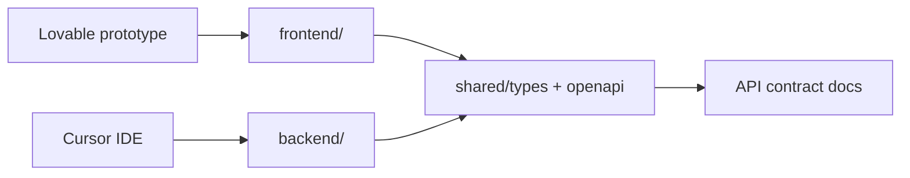

# Cursor.ai + Lovable integration

How **Cursor** (backend) and **Lovable** (frontend prototype) stay aligned on **`github.com/1commandai/platform`**.

## Workflow



1. **Lovable** exports UI to `frontend/` (or sync repo `1commandai/frontend`).
2. **Cursor** implements `backend/` modules against **`shared/types`** and OpenAPI.
3. **Regenerate** `shared/openapi/openapi.json` when routes change.
4. **Cursor rules** (`.cursorrules` + `.cursor/rules/SYSTEM-PROMPT.mdc`) reference components when adding APIs.

## GitHub

| Repo | Role |
|------|------|
| [github.com/1commandai/platform](https://github.com/1commandai/platform) | Monorepo: `frontend/`, `backend/`, `shared/` |
| [github.com/1commandai/frontend](https://github.com/1commandai/frontend) | Lovable prototype mirror (optional split) |

Connect the repo in **Cursor Settings → GitHub** so agents have full tree context.

## Cursor context files

| File | Purpose |
|------|---------|
| `.cursorrules` | Project root rules for Cursor Agent |
| `.cursor/rules/SYSTEM-PROMPT.mdc` | Always-on platform architecture |
| `docs/API-CONTRACT.md` | FE/BE contract |
| `shared/types/api.ts` | Shared `User`, `Agent` types |

## Prompting backend work

When adding an API for a screen:

1. Open the matching file under `src/components/` or `frontend/src/components/`.
2. List fields the UI reads/writes.
3. Add Zod validation + `@openapi` JSDoc on routes.
4. Map responses to `shared/types/api.ts` (extend shared types if the contract changes).
5. Run `npm run openapi:export` and `npm run openapi:types`.

Example agent instruction:

> Implement `GET /api/v1/agents` for Agent Registry. Use `Agent` from `shared/types/api.ts`. Match filters in `RoleHierarchyAdmin.tsx`. Document with `@openapi`.

## Local dev

```bash
npm run backend:dev    # API :3000
npm run frontend:dev   # Vite :5173, proxies /api
```

## TypeScript paths

| Package | Alias | Maps to |
|---------|-------|---------|
| Frontend | `@/*` | `src/*` |
| Frontend | `@shared/*` | `shared/*` |
| Backend | `@modules/*`, `@common/*`, `@config/*` | `backend/src/...` |

Import shared types in UI:

```ts
import type { User, Agent } from '@shared/types/api';
```
